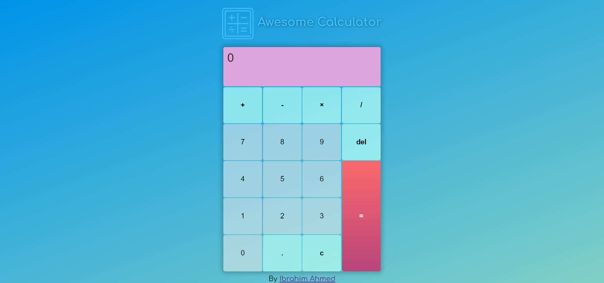

## Awesome Calculator

This is a simple responsive calculator made with HTML and CSS, javscript, flexbox and CSS Grid with some transitions in it

Users should be able to:

- make math operations like add, sub, divid and mult
- See hover states for interactive elements

### Screenshot

you can try it from here:

- Live Site URL:(https://ibrahim11elian.github.io/awesome-calculator/)

### Built with

- Semantic HTML5 markup
- CSS custom properties
- Flexbox
- CSS Grid
- javscript

## Author

- Frontend Mentor - [@ibrahim11elian](https://www.frontendmentor.io/profile/ibrahim11elian)
- Facebook : [@ibrahim11ahmed](https://www.facebook.com/ibrahim11ahmed/)
- Linkedin : [@ibrahim-ahmed-a8bba9196](https://www.linkedin.com/in/ibrahim-ahmed-a8bba9196/)
